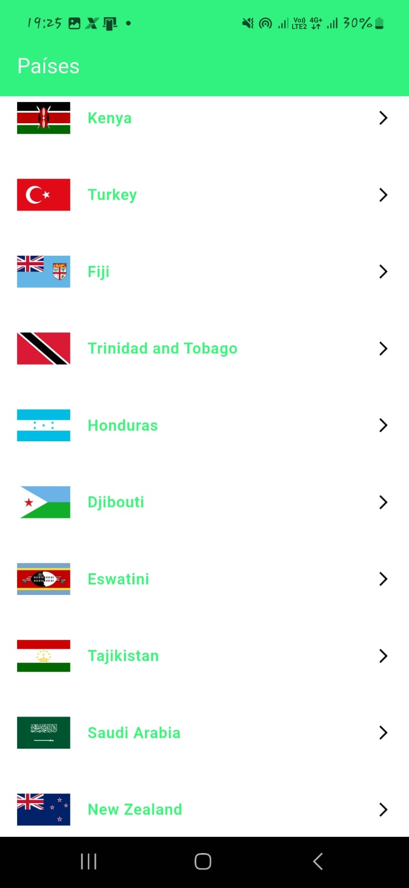
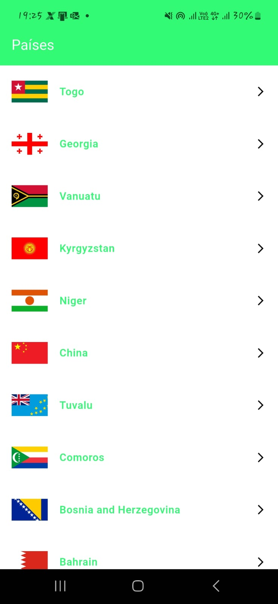
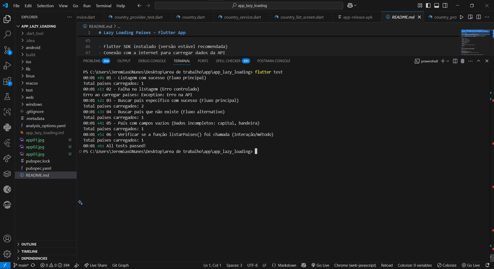

# Lazy Loading Países - Flutter App

Este projeto é um aplicativo Flutter que exibe uma lista de países com suas respectivas bandeiras utilizando carregamento preguiçoso (*lazy loading*). A aplicação consome uma API pública para obter dados atualizados sobre os países, exibindo os itens em páginas de 10 elementos por vez, carregando mais países conforme o usuário rola a lista para baixo.

## Funcionalidades

- **Lista paginada (lazy loading):** exibe os países em blocos, carregando mais itens conforme o usuário chega próximo do final da lista.
- **Detalhes do país:** ao tocar em um país, abre uma tela com a bandeira e o nome do país.
- **Indicador de carregamento:** exibe spinner enquanto os dados estão sendo carregados.
- **Pull-to-refresh:** permite atualizar a lista puxando para baixo.
- **Gerenciamento de estado:** utiliza o `Provider` para controle eficiente dos dados e atualização da UI.
- **Tratamento de erros:** exibe ícones substitutos quando a imagem da bandeira não pode ser carregada.
- **Código comentado:** todos os arquivos possuem comentários explicativos para facilitar o entendimento.

## Estrutura do projeto

- `model/`: classe `Country` para representar os dados do país.
- `provider/`: gerenciamento de estado e lógica de paginação.
- `services/`: requisições HTTP e conversão dos dados.
- `screens/`: telas do app (`CountryListScreen` e `CountryDetailScreen`).
- `widget/`: componentes reutilizáveis (itens de país, indicadores, etc).
- `core/`: constantes globais, como cores e espaçamentos.

## Capturas de Tela

### Lista de Países e Detalhes

<p float="left">
  
  
  
</p>

### Testes com Mockito

<p float="left">
  
</p>

## Como usar

1. Clone este repositório:
   ```bash
   git clone <url-do-repositorio>